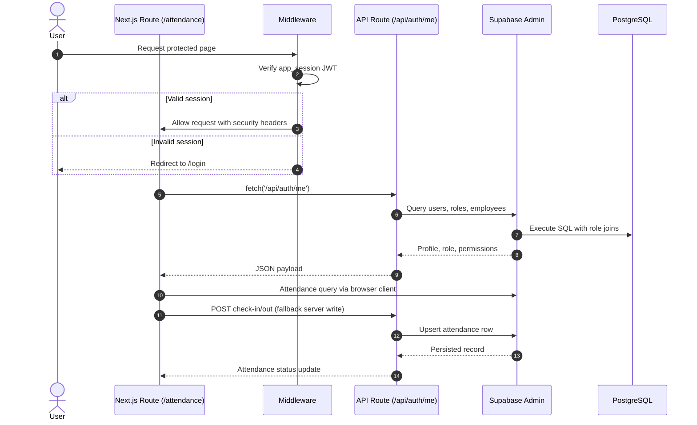

# Cyanora HRMS

> "Cyanora HRMS — Simplify Human Resource Management with Modern Web Technology."

## Table of Contents
- [🧭 Overview](#-overview)
- [🏗️ Architecture](#-architecture)
- [⚙️ Installation & Setup](#-installation--setup)
- [📂 Folder Structure](#-folder-structure)
- [🚀 Usage](#-usage)
- [🧰 Tech Stack & Dependencies](#-tech-stack--dependencies)
- [🤝 Contributing & Maintenance](#-contributing--maintenance)
- [🧩 Database Schema Overview](#-database-schema-overview)
- [📈 Future Improvements](#-future-improvements)
- [🪪 License & Credits](#-license--credits)

## 🧭 Overview
Cyanora HRMS is a modern web-based human resource management system that unifies employee lifecycle processes—from onboarding and authentication to daily operations such as attendance, leave, and announcements—inside a cohesive Next.js 15 experience. The frontend embraces server-centric rendering and a responsive shadcn/ui design language, while Supabase services supply realtime data, secure storage, and fine-grained permission controls for HR, administrators, and employees.【F:package.json†L2-L39】【F:src/components/permission-guard.tsx†L13-L79】

The platform is engineered to give HR teams clarity and speed: integration with Supabase provides a secure PostgreSQL foundation, row-level APIs, and granular RBAC enforcement, whereas Prisma acts as the local ORM for NextAuth-backed user identities.【F:src/lib/supabase-admin.ts†L1-L12】【F:src/lib/auth.ts†L1-L24】 Rich attendance tools capture geolocation, track check-in/check-out states, and automatically sync with employee records so every stakeholder sees accurate, up-to-date data.【F:src/components/take-attendance.tsx†L1-L200】【F:src/app/attendance/page.tsx†L1-L20】

Cyanora HRMS targets three primary personas. Administrators manage master data and user provisioning, HR officers approve leave and monitor attendance, and employees execute day-to-day tasks such as logging time, requesting leave, and reading announcements. Dynamic permission guards at the page level ensure each persona only accesses the modules they need, yielding a secure, role-aware workspace.【F:src/components/permission-guard.tsx†L13-L79】【F:src/app/api/auth/me/route.ts†L18-L181】

## 🏗️ Architecture
Cyanora HRMS uses a layered architecture that separates presentation, business logic, and persistence while keeping the deployment pipeline cloud-native.

### Frontend layer
- **Framework:** Next.js 15 with React Server Components and Turbopack-backed builds for both development and production commands.【F:package.json†L5-L39】
- **UI system:** Tailwind CSS, shadcn/ui primitives, and Lucide icons create a consistent visual language across dashboards, modals, and mobile-first layouts.【F:package.json†L16-L39】【F:src/app/attendance/page.tsx†L1-L20】
- **Session awareness:** Middleware and client guards enforce session validity and hydrate pages with user/permission data fetched from Supabase-backed endpoints.【F:src/middleware.ts†L1-L86】【F:src/components/permission-guard.tsx†L13-L79】

### Backend layer
- **Auth & identity:** NextAuth with a Prisma adapter persists OAuth-issued accounts (e.g., Google) while bridging to a custom JWT (`app_session`) used across API routes and middleware.【F:src/lib/auth.ts†L1-L24】【F:src/lib/jwt.ts†L1-L36】
- **Business APIs:** Route handlers under `src/app/api` orchestrate server-side logic such as resolving employee profiles, checking permissions, and writing attendance entries through Supabase admin access.【F:src/app/api/auth/me/route.ts†L18-L181】【F:src/app/api/attendance/today/route.ts†L1-L168】
- **Utilities:** Shared utilities (Supabase clients, Prisma client, rate limiter) provide reusable infrastructure for server and client modules.【F:src/lib/supabase.ts†L1-L24】【F:src/lib/prisma.ts†L1-L11】【F:src/lib/rate-limit.ts†L1-L16】

### Data & storage layer
- **Database:** Supabase-hosted PostgreSQL stores HR domain tables (employees, attendance, leave, announcements) alongside NextAuth tables managed by Prisma; Postgres enums capture employee states and leave workflows.【F:prisma/schema.prisma†L1-L54】【F:src/app/api/attendance/today/route.ts†L48-L161】【F:src/lib/leave.ts†L25-L59】
- **Storage & assets:** Supabase Storage stores employee avatars and shared documents via signed URLs (config hooks in `src/lib/supabase.ts` and `src/lib/supabase-browser.ts`).【F:src/lib/supabase.ts†L1-L24】【F:src/lib/supabase-browser.ts†L1-L10】
- **Secrets management:** Environment variables supply Supabase credentials, Prisma connection strings, OAuth keys, and JWT secrets for secure deployments.【F:src/lib/supabase-admin.ts†L3-L12】【F:src/lib/auth.ts†L10-L13】【F:src/lib/jwt.ts†L3-L34】

### Deployment pipeline
The repository ships with Turbopack-ready scripts, making Vercel the default CI/CD target: push-to-main builds trigger automated previews, while `vercel --prod` promotes releases to production with integrated environment variable management.【F:package.json†L5-L9】

### Core flows


## ⚙️ Installation & Setup
### Prerequisites
- Node.js 20+
- Supabase account with a project configured for PostgreSQL, Auth, and Storage
- Vercel CLI (`npm install -g vercel`) for deployments and preview management

### Clone & install
```bash
git clone https://github.com/<username>/cyanora.git
cd cyanora
npm install
npm run dev
```

### Environment variables
Create a `.env.local` file based on the template below before running the app locally:

```makefile
NEXT_PUBLIC_SUPABASE_URL=
NEXT_PUBLIC_SUPABASE_ANON_KEY=
SUPABASE_URL=
SUPABASE_ANON_KEY=
SUPABASE_SERVICE_ROLE_KEY=
DATABASE_URL=
NEXTAUTH_URL=http://localhost:3000
NEXTAUTH_SECRET=
AUTH_JWT_SECRET=
GOOGLE_CLIENT_ID=
GOOGLE_CLIENT_SECRET=
```
- Supabase keys feed both server and browser clients; missing values trigger runtime warnings to help diagnostics.【F:src/lib/supabase.ts†L3-L13】【F:src/lib/supabase-browser.ts†L1-L10】【F:src/lib/supabase-admin.ts†L3-L12】
- OAuth credentials enable Google sign-in through NextAuth.【F:src/lib/auth.ts†L6-L21】
- JWT secrets secure middleware/session validation.【F:src/lib/jwt.ts†L3-L35】

### Database migrations
Provision the NextAuth tables with Prisma:
```bash
npx prisma migrate dev
```
This command targets the `DATABASE_URL` specified above and prepares the user/session tables used by NextAuth.【F:prisma/schema.prisma†L1-L54】

## 📂 Folder Structure
| Path | Purpose |
| --- | --- |
| `src/app` | App Router pages, layouts, API handlers, and feature routes such as attendance, dashboard, HR tools, and authentication flows.【F:src/app/attendance/page.tsx†L1-L20】【F:src/app/api/attendance/today/route.ts†L1-L168】 |
| `src/components` | Reusable UI building blocks (shadcn/ui wrappers, permission guards, attendance widgets) consumed across pages.【F:src/components/permission-guard.tsx†L13-L79】【F:src/components/take-attendance.tsx†L1-L200】 |
| `src/lib` | Shared infrastructure modules: Supabase clients, Prisma client, authentication helpers, JWT utilities, and domain helpers (leave calculations, rate limiting).【F:src/lib/supabase.ts†L1-L24】【F:src/lib/auth.ts†L1-L24】【F:src/lib/leave.ts†L1-L59】 |
| `prisma` | Prisma schema and migration management for NextAuth and local database typing.【F:prisma/schema.prisma†L1-L54】 |
| `public` | Static assets (icons, placeholder media) served directly by Next.js. |
| `scripts` | Build-time tooling such as route integrity checks invoked by `npm run prebuild`.【F:package.json†L5-L8】 |

## 🚀 Usage
### Authentication
- Navigate to `/login` and sign in with your Google workspace account; NextAuth persists the session and stores the user ID within the session payload.【F:src/lib/auth.ts†L6-L21】
- On success, the middleware issues an `app_session` JWT which subsequent requests validate before serving protected content.【F:src/middleware.ts†L17-L69】【F:src/lib/jwt.ts†L3-L35】
- Logout is handled via NextAuth’s `signOut` helper and clears session cookies on both Next.js and Supabase.

### Role-based navigation
Permission guards interpret role and permission codes to gate entry to dashboards and API calls:
- **Admin:** Full access to employee directory, role management, and announcement modules (permissions like `EMP_VIEW`, `EMP_EDIT`, `USER_CREATE`).【F:src/components/permission-guard.tsx†L13-L44】【F:src/app/api/auth/me/route.ts†L36-L181】
- **HR:** Leave approvals and attendance oversight (permissions include `LEAVE_APPROVE`).【F:src/components/permission-guard.tsx†L13-L44】
- **Employee:** Attendance logging, leave requests, profile review, and announcement feeds (permissions such as `ATTENDANCE_LOG` and `LEAVE_REQUEST`).【F:src/components/permission-guard.tsx†L13-L44】【F:src/app/attendance/page.tsx†L1-L20】

### Daily flows
- **Attendance:** `/attendance` renders a responsive check-in experience with geolocation capture, offline fallback to the Supabase browser client, and auto-open reminders if the user has not checked in yet.【F:src/app/attendance/page.tsx†L1-L20】【F:src/components/take-attendance.tsx†L27-L189】
- **Leave:** Leave balances are calculated from Supabase tables, prioritising `leave_balances` snapshots with a fallback to `leave_requests` for dynamic computation.【F:src/lib/leave.ts†L19-L59】
- **Dashboard & navigation:** The sidebar-enabled dashboard (`/dashboard`) aggregates widgets, analytics placeholders, and quick links to attendance, leave, and HR tooling.

Primary routes: `/dashboard`, `/attendance`, `/leave`, `/profile`, and `/home`. Use the mobile navigation bar to move between modules quickly.【F:src/app/attendance/page.tsx†L1-L20】

### Visual reference


## 🧰 Tech Stack & Dependencies
- **Next.js 15 & React 19** — App Router with RSC, streaming, and Turbopack for rapid builds.【F:package.json†L5-L35】
- **TypeScript** — Strict typing across server and client modules.【F:package.json†L47-L49】
- **Prisma ORM** — Database access layer for NextAuth tables and auxiliary models.【F:package.json†L15-L32】【F:prisma/schema.prisma†L1-L54】
- **Supabase (Auth, Postgres, Storage)** — Primary data platform for HR entities, role/permission metadata, and secure file storage.【F:src/lib/supabase.ts†L1-L24】【F:src/app/api/auth/me/route.ts†L36-L181】
- **Tailwind CSS + shadcn/ui + Radix primitives** — UI primitives and utility-first styling for consistent design tokens.【F:package.json†L16-L39】
- **Lucide React** — Iconography suite for navigation and status feedback.【F:package.json†L28-L29】
- **React Hook Form + Zod** — Form handling and schema validation (used across onboarding and HR workflows).【F:package.json†L14-L38】
- **ESLint & Prettier (via Next tooling)** — Code formatting and linting integrated into the Next.js toolchain.

## 🤝 Contributing & Maintenance
1. **Branching strategy:**
   - `main` holds production-ready deployments.
   - `dev` aggregates validated features.
   - Create feature branches from `dev` (e.g., `feature/attendance-summary`).
2. **Commit convention:**
   ```makefile
   feat: add attendance summary component
   fix: resolve Supabase auth bug
   chore: align Prisma schema with Supabase enums
   ```
3. **Testing & quality gates:**
   - Run `npm run dev` for interactive development and `npm run build` before submitting PRs.【F:package.json†L5-L9】
   - Execute targeted checks (lint, type checking) as configured in the repository.
4. **Pull requests:**
   - Rebase on `dev`, open PRs against `dev`, ensure CI passes, and request reviewer sign-off.
5. **Deployment:**
   ```bash
   vercel --prod
   ```
   Promote approved changes to production after verifying the preview deployment.

## 🧩 Database Schema Overview
### Core tables & enums
- **users / accounts / sessions / verification_tokens:** Prisma-managed NextAuth tables persisted in PostgreSQL.【F:prisma/schema.prisma†L10-L54】
- **employees:** Stores profile metadata, employment status enums, department and position relations resolved in the `/api/auth/me` handler.【F:src/app/api/auth/me/route.ts†L62-L176】
- **attendance:** Tracks daily presence, geolocation, and workflow status (`HADIR`, etc.) driven by API writes.【F:src/app/api/attendance/today/route.ts†L48-L161】【F:src/components/take-attendance.tsx†L27-L189】
- **leave_requests / leave_balances:** Leave requests, approvals, and yearly quotas with enums for leave type and approval status.【F:src/lib/leave.ts†L25-L59】
- **announcements:** Stores organization-wide updates surfaced in dashboards and inbox modules (Supabase-managed).
- **role_permissions / permissions / roles:** Maps RBAC metadata consumed by permission guards.【F:src/app/api/auth/me/route.ts†L36-L151】

### Relationship summary
- `roles` 1—* `role_permissions` *—1 `permissions`
- `users` 1—* `employees` (by email association)
- `employees` 1—* `attendance`
- `employees` 1—* `leave_requests` and 1—1 `leave_balances`

### Sample queries
```sql
-- Attendance snapshot for a specific employee and day
select * from attendance
where employee_id = $1
  and attendance_date = current_date;

-- Approved leave summary
select employee_id, sum(total_days) as days
from leave_requests
where status = 'APPROVED'
  and leave_type = 'CUTI_TAHUNAN'
  and start_date between date_trunc('year', now()) and now()
group by employee_id;

-- Role permissions lookup
select rp.allowed, p.code
from role_permissions rp
join permissions p on p.id = rp.permission_id
where rp.role_id = $1;
```

## 📈 Future Improvements
- AI-assisted attendance validation (geofencing + anomaly detection).
- Email/SMS notifications for approvals, announcements, and policy updates.
- Native mobile companion apps (React Native/Flutter) for field employees.
- HR analytics dashboards with drill-down metrics, predictive attrition scoring, and workforce planning insights.

## 🪪 License & Credits
- **License:** MIT License (see [`LICENSE`](./LICENSE)).
- **Author:** Ilham Ahsan Saputra

Cyanora HRMS — Simplify Human Resource Management with Modern Web Technology.
